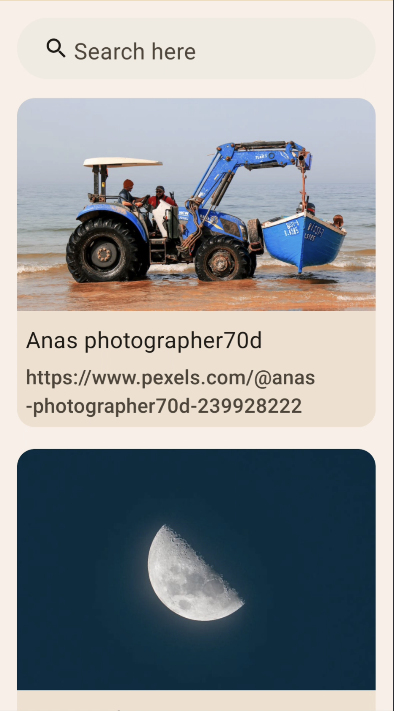
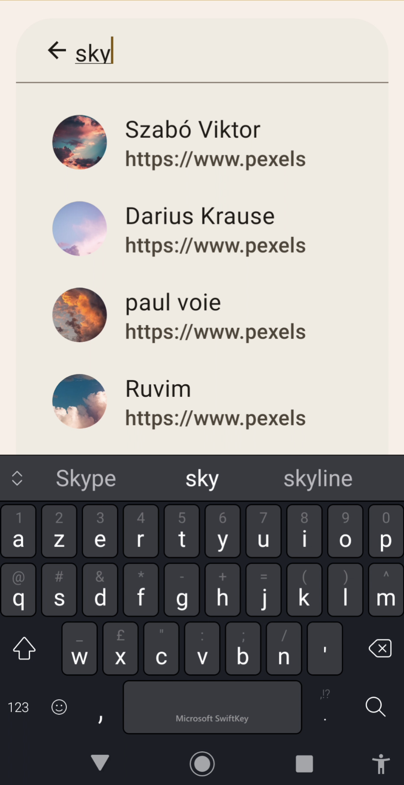

# Pierre Demo

## Overview
* I used a Google Sample about Compose as base for this project.
* I used the MVVM architecture.
* UI (Compose) -> ViewModel -> Repository -> (Retrofit/Room)
* I've tested the ViewModel (cause it's the only one with logic) with JUnit and Mockito.
* I've no interest to use Dagger/Hilt/Koin for this small project
* No point to use Flow or Flow.collect

## How to use
* 1/ Make a search (by clicking to the top bar)
* 2/ Enter few letter (ex: moon)
* 3/ Click on the dropdown (or Enter with the keybboard) redirect to the SEARCH screen
* 4/ With the SEARCH or DETAIL screen: you can tap the Star to add/remove from your favorite list
* 5/ Use the back button to get back to the SEARCH screen (first screen) or restart the App

## Design & Screenshots

